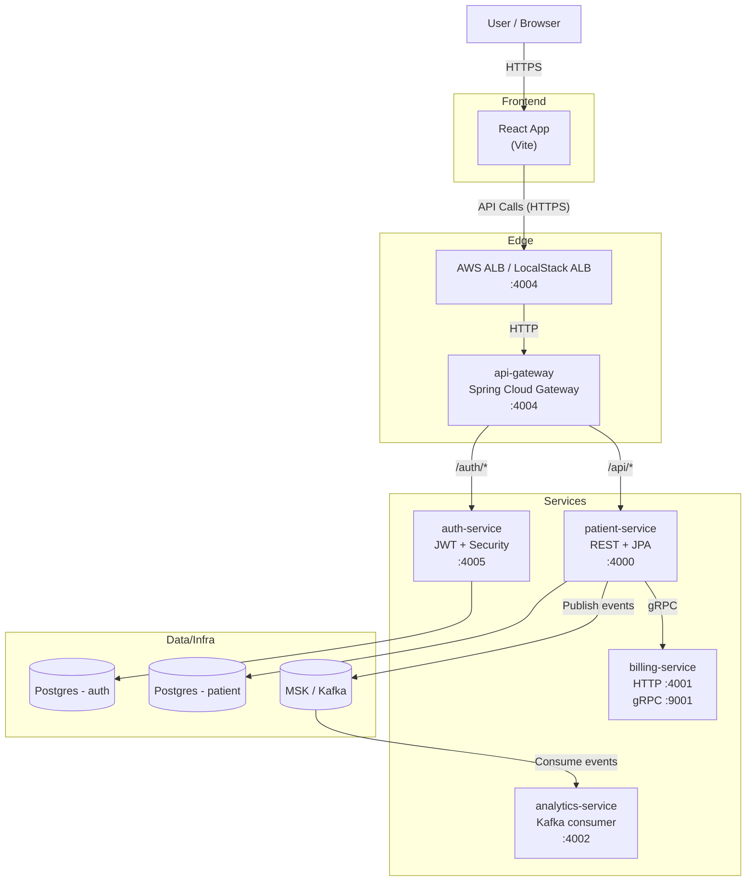

# Patient Management (Microservices)

Patient Management is a complete full-stack system built with **Java 21 + Spring Boot** microservices and a **React + Vite** frontend.
It demonstrates a typical healthcare-style domain split into services (patients, auth, billing, analytics) behind a single edge **API Gateway**, with real-time event streaming via **Kafka**, and infrastructure provisioning for both **LocalStack** and real **AWS** environments.

## Architecture

> If the architecture diagram doesn't display, then copy the code block into https://mermaid.live.



## What’s in this repo

### Frontend
- **frontend** (React + Vite + TypeScript)
  - Modern UI for managing patients and viewing analytics.
  - Uses **TanStack Query** for data fetching and caching.
  - Integrated with **Stripe** for payments (in billing flow).

### Services
- **api-gateway** (Spring Cloud Gateway)
  - Single entrypoint for HTTP clients.
  - Runs on **port 4004**.
- **auth-service** (Spring Boot + Spring Security + JWT + JPA)
  - Issues and validates JWTs.
  - Runs on **port 4005**.
  - Uses Postgres (provisioned via the infra stack; H2 exists for dev/test).
- **patient-service** (Spring Boot + JPA + Validation)
  - CRUD for patients.
  - Runs on **port 4000**.
  - Emits `PatientCreated` and other events to **Kafka**.
  - Calls billing-service over **gRPC**.
- **billing-service** (Spring Boot + gRPC)
  - Billing/account operations over HTTP and gRPC.
  - Runs on **HTTP 4001** and **gRPC 9001**.
- **analytics-service** (Spring Boot + Kafka)
  - Consumes events from Kafka to track metrics (e.g., new patient registrations).
  - Runs on **port 4002**.

### Infrastructure
- **infrastructure/** is an AWS CDK (Java) app.
- Supports two deployment targets:
  1. **LocalStack**: Emulated AWS services locally.
  2. **Real AWS**: Cost-efficient Fargate deployment (see `AWS_DEPLOYMENT.md`).

### Requests & tests
- `api-requests/**` contains ready-to-run HTTP request files (JetBrains HTTP client).
- `grpc-requests/**` contains gRPC HTTP client requests.
- `integration-tests/**` contains JUnit + RestAssured integration tests.

## Tech stack
- **Frontend**: React, Vite, TypeScript, TanStack Query, Stripe elements.
- **Backend**: Java 21, Spring Boot, Spring Cloud Gateway.
- **Data**: PostgreSQL (RDS), Kafka (MSK).
- **Communication**: REST (Frontend -> Backend), gRPC (Service -> Service), Kafka (Event-driven).
- **Infrastructure**: AWS CDK v2 (Java), Docker, LocalStack.
- **Testing**: JUnit 5, RestAssured, Vitest (Frontend).

## Prerequisites
- **Java 21**
- **Node.js 20+** (for frontend)
- **Docker + Docker Desktop**
- **AWS CLI**
- **CDK CLI** (`npm install -g aws-cdk`)

## Running locally (LocalStack)

### 1) Start LocalStack
Start LocalStack in Docker, exposing the edge port:

```bash
docker run --rm -it \
  -p 4566:4566 \
  -e SERVICES=cloudformation,ec2,ecs,elbv2,iam,logs,rds,route53,msk,servicediscovery \
  localstack/localstack
```

### 2) Build container images
Each microservice has a Dockerfile. Build them from the repo root:

```bash
docker build -t api-gateway ./api-gateway
docker build -t auth-service ./auth-service
docker build -t patient-service ./patient-service
docker build -t billing-service ./billing-service
docker build -t analytics-service ./analytics-service
```

### 3) Synthesize the CDK template (LocalStack)
From `infrastructure/`:

```bash
# Windows
cd infrastructure
mvnw.cmd -DskipTests exec:java -Dexec.mainClass=com.pm.stack.LocalStack
```

### 4) Deploy into LocalStack
From `infrastructure/`:

```bash
# Windows (PowerShell)
$env:AWS_ACCESS_KEY_ID="test"
$env:AWS_SECRET_ACCESS_KEY="test"
$env:AWS_DEFAULT_REGION="us-east-1"
aws --endpoint-url=http://localhost:4566 cloudformation deploy --stack-name patient-management --template-file .\\cdk.out\\localstack.template.json
```

### 5) Run Frontend
From `frontend/`:

```bash
cd frontend
npm install
npm run dev
```
The frontend will run at `http://localhost:5173` (by default).

## Deploying to AWS


## Architecture Diagram

```
                    ┌─────────────────────────────────────────┐
                    │              AWS Cloud                  │
                    │                                         │
   Internet ───────►│  ┌─────────┐    ┌──────────────────┐    │
                    │  │   ALB   │───►│   API Gateway    │    │
                    │  └─────────┘    │   (Fargate)      │    │
                    │                 └────────┬─────────┘    │
                    │                          │              │
                    │     ┌────────────────────┼───────────┐  │
                    │     │        Service Discovery       │  │
                    │     │     (patient-management.local) │  │
                    │     └────────────────────┼───────────┘  │
                    │                          │              │
                    │  ┌─────────┬─────────┬───┴───┬───────┐  │
                    │  │  Auth   │ Patient │Billing│Analyt.│  │
                    │  │ Service │ Service │Service│Service│  │
                    │  │(Fargate)│(Fargate)│(Farg.)│(Farg.)│  │
                    │  └────┬────┴────┬────┴───────┴───────┘  │
                    │       │         │                       │
                    │       └────┬────┘                       │
                    │            ▼                            │
                    │    ┌──────────────┐                     │
                    │    │  RDS Postgres │                    │
                    │    │   (Shared)    │                    │
                    │    └──────────────┘                     │
                    │                                         │
                    └─────────────────────────────────────────┘
```

We provide scripts to simplify the process:
* **Windows**: `aws-deploy.ps1`
* **Linux/Mac**: `aws-deploy.sh`

These scripts handle building images, pushing to ECR, and deploying the CDK stack.

## Architecture & Data Flow

### Patient Creation Flow
1. **Frontend** sends `POST /api/patients` to **API Gateway**.
2. **API Gateway** routes to **Patient Service**.
3. **Patient Service**:
  * Saves patient to Postgres (`patient` schema).
  * Calls **Billing Service** via **gRPC** to initialize account.
  * Publishes `PatientCreated` event to **Kafka**.
4. **Analytics Service** consumes the event and updates dashboard metrics.

## Troubleshooting

### Frontend connection issues
* Ensure the `VITE_API_URL` environment variable is pointing to your ALB/Gateway (e.g., `http://localhost:4004` usually proxied or directly addressing the load balancer).

### Kafka/Analytics issues
* If analytics aren't updating, check **MSK** logs in LocalStack or AWS.
* Ensure **analytics-service** is up and consuming the correct topic.

## Repo layout

```
frontend/             # React + Vite application
api-gateway/          # Spring Cloud Gateway edge service
auth-service/         # Auth + JWT
patient-service/      # Patient CRUD + events
billing-service/      # Billing + gRPC
analytics-service/    # Kafka consumer + reporting
infrastructure/       # AWS CDK (Java) for LocalStack & AWS
api-requests/         # HTTP requests (JetBrains)
integration-tests/    # JUnit + RestAssured
```
